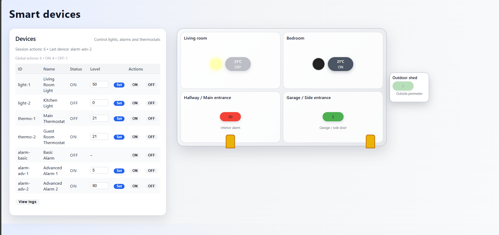

# Week 1
## Bean Creation

The application demonstrates three different ways of defining Spring beans:

* Beans discovered by component scanning
    * Classes like: StateChangeLogger, LoggingAspect are annotated with @Component or @Service, allowing Spring to detect them automatically.

* Beans defined in configuration classes
    * In SmartHomeConfig, multiple smart-home devices are created using @Bean methods.
      Each method returns a fully configured device instance (light, thermostat, alarm).

* There is also a programmatic registration mechanism that adds a device at runtime.

## Dependency Injection

All services and controllers use constructor injection.
This makes dependencies explicit and improves testability and clarity.


## Abstractions and Interfaces

All smart-home devices implement a common interface, SmartDevice.
Each type of device provides its own behavior but is accessed through the shared contract.

## Bean Scopes and Lifecycle

Two different scopes are used:

* Singleton (default)

    * Most beans—such as devices, controller, registry, loggers—are created once and reused.

* Prototype

    * UserSessionContext is declared as prototype.
    * Each request for this bean results in a new instance, demonstrated using a dedicated controller endpoint.


## Aspect-Oriented Programming

A single aspect, LoggingAspect, intercepts method calls on all smart-home devices.
When a device is turned on, turned off, or has its level changed, an entry is recorded via StateChangeLogger.

## Programmatic Bean Registration

The application dynamically registers a new device (a smart plug) at startup using the application context.

# Week 2

## REST API

The application exposes a REST API for managing smart-home devices:

* GET /api/devices – list all devices
* GET /api/devices/{id} – retrieve device details
* POST /api/devices/{id}/on / off – change device state
* POST /api/devices/{id}/level – update the level (for lights and thermostats)
* GET /api/devices/log – read the history of state changes

All endpoints return ResponseEntity, allowing explicit control of HTTP status codes, headers, and response bodies. \
Validation and errors are handled locally using try/catch, producing clear REST responses (200, 202, 400, etc.). \
Business logic was moved into SmartHomeService, while the controller focuses only on HTTP concerns.

## Thymeleaf 

A web interface (devices.html) was added to interact with the system visually. (+ DevicePageController)

* Displays all devices in a table with actions for:

    * turning devices ON / OFF

    * updating levels (only for devices that support them)

* Includes an interactive smart-home layout, where each device is represented visually:

    * lights change brightness according to level

    * thermostats display temperature and ON/OFF state

* alarms change color based on sensitivity level

* one alarm is placed at the main entrance, one at the garage, and the basic alarm is shown in an outdoor shed



## Web Scopes in Spring (Request, Session, Application)
1. Request Scope \
Used to attach information that belongs only to the current HTTP request.
The application creates a request-scoped trace object so each REST call receives its own unique metadata.\
```header("request-id", requestTrace.getRequestId())``` - each request gets a unique request ID that is logged and returned in the response headers.

2. Session Scope \
Used to track data that should persist for the current user across multiple requests.
The app stores per-user statistics such as how many device actions they performed and which device they interacted with last.

3. Application Scope \
Used to keep global information shared by the entire application.
Here, the system tracks overall usage statistics: total device actions, total ON/OFF operations, etc.